# Práctica 1: Modelos de servicio y despliegue: exploración de consolas, calculadoras de costos y alertas de presupuesto

* **Institución:** Instituto Politécnico Nacional - Escuela Superior de Cómputo (ESCOM)
* **Carrera:** Ingeniería en Sistemas Computacionales
* **Academia:** Sistemas Distribuidos
* **Materia:** Sistemas Distribuidos (Plan 2020)
* **Práctica:** PRÁCTICA 1 - Modelos de servicio y despliegue: exploración de consolas, calculadoras de costos y alertas de presupuesto
* **Grupo:** 7CV1 — Semestre 27/1
* **Profesor:** Rodrigo Ojeda Santillán
* **Integrantes del equipo:**
  * Israel Márquez Cárdenas (2022300395)
  * Esaul Tellez de la Cruz (2023630692)
  * Alumno 3 (Boleta)

---

## 1. Cuentas del equipo y configuración de facturación

A continuación se detallan las cuentas configuradas en las plataformas de nube pública utilizadas para la práctica:

### Tabla 1. Cuentas del equipo
| Integrante | Proveedor | Identificador de cuenta | Unidad de facturación | Región México | Créditos y vencimiento | Correo de alertas |
| :--- | :--- | :--- | :--- | :--- | :--- | :--- |
| Israel Márquez | AWS | 438456518128 | Cuenta de AWS | Sí (mx-central-1) | $120.00 USD (1 año) | israelisipo@gmail.com |
| Israel Márquez | Azure | 87d70be2-e280-4fac-81bb-8e620dc4b7ba | Suscripción (Azure for Students) | Sí (Mexico Central) | $100.00 USD (1 año) | israelisipo@gmail.com |
| Esaul Tellez de la Cruz | AWS | 528724997695| Cuenta de AWS | Sí (mx-central-1) | $100.00 USD (6 meses) | etellezd1900@alumno.ipn.mx |
| Esaul Tellez de la Cruz | Azure | 1aaa6fc3-e0a8-48b4-b67b-63db395edde7 | Suscripción (Azure for Students) | Sí (Mexico Central) | $100.00 USD (12 meses) | etellezd1900@alumno.ipn.mx |
| Alumno 3 | AWS | 9876-5432-1098 | Cuenta de AWS | Sí (mx-central-1) | $200.00 USD (6 meses) | correo3@ejemplo.com |
| Alumno 3 | Azure | 11111111-1111-1111-1111-111111111111 | Suscripción (Azure for Students) | Sí (Mexico Central) | $100.00 USD (12 meses) | correo3@ejemplo.com |

### Evidencias de la Fase 1 (Actividad A1: Reconocimiento de consola y facturación)

#### Amazon Web Services (AWS)

**1. Identificador de cuenta (12 dígitos):**

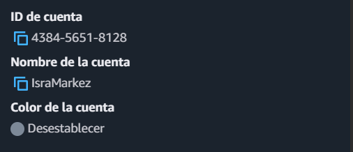

 

**2. Región México (Querétaro `mx-central-1`):**

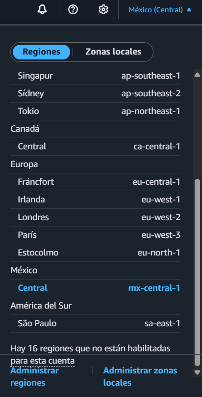

 

**3. Facturación actual ($0.00 USD) y saldo de créditos:**

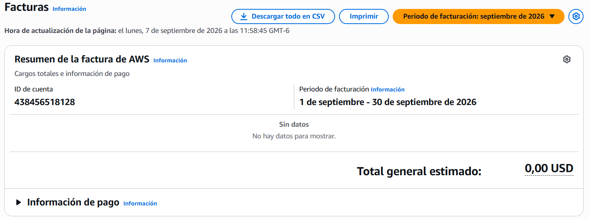

 

#### Microsoft Azure

**1. Identificador de suscripción (Azure for Students):**

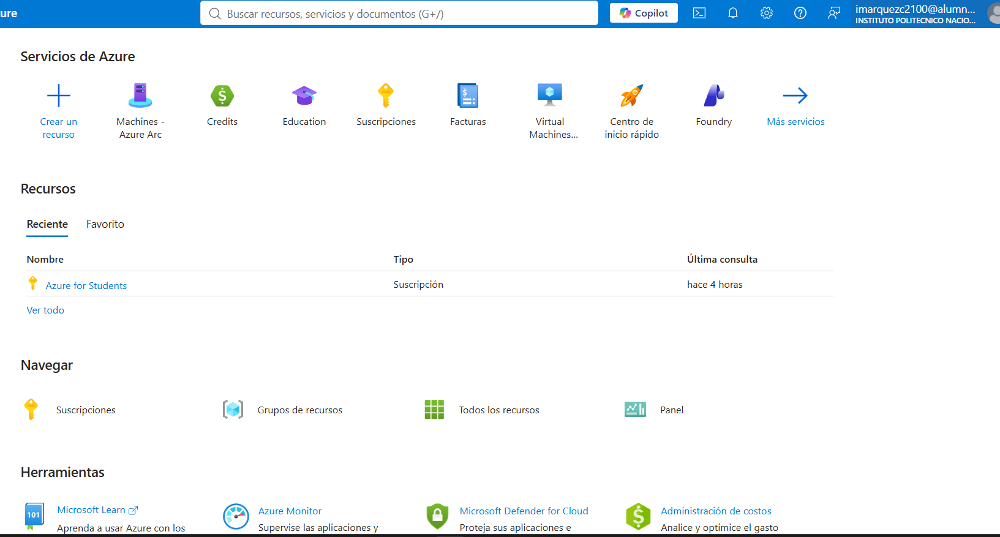

 

**2. Región México (`Mexico Central`):**

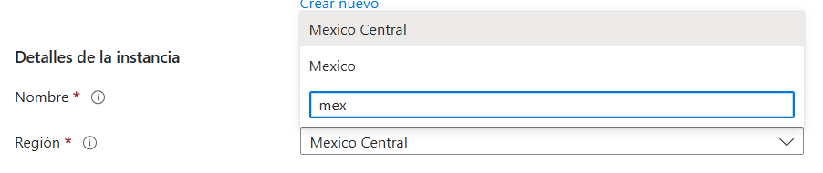

 

**3. Facturación actual ($0.00 USD) y créditos educativos:**

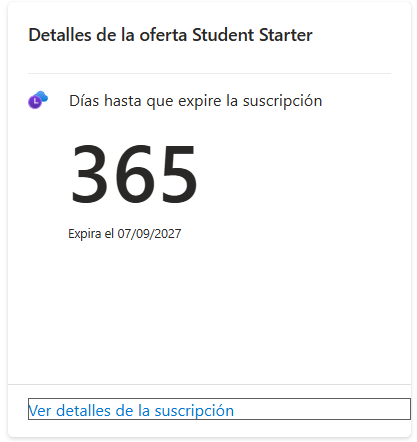

---

## 2. Configuración de alertas de presupuesto (Actividad A2)

Se establecieron los presupuestos obligatorios y umbrales preventivos en ambos proveedores:

* **En AWS:**
  1. Presupuesto de costo cero (`P1-israel-aws-cero`) para alertar ante cualquier consumo que exceda la capa gratuita (> $0.01 USD).
  2. Presupuesto mensual de $5.00 USD (`P1-israel-aws`) con cuatro umbrales: 50% real ($2.50 USD), 80% real ($4.00 USD), 100% real ($5.00 USD) y 100% pronóstico (*forecasted*).
* **En Azure:**
  1. Presupuesto mensual de $5.00 USD (`P1-israel-azure`) vinculado a la suscripción de estudiante, con umbrales idénticos del 50%, 80%, 100% de gasto real y 100% proyectado.

### Evidencias de Presupuestos y Alertas

#### Amazon Web Services (AWS)

**1. Lista de presupuestos con gasto actual en $0.00 USD:**

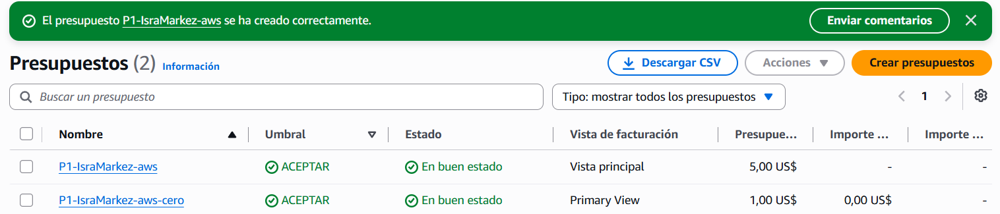

 

**2. Detalle del presupuesto de 5 USD con los 4 umbrales y correo:**

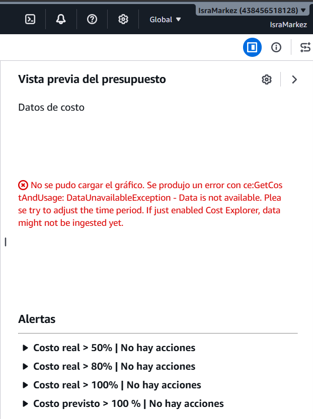

 

**3. Evidencia viva de monitoreo continuo (Estado OK):**

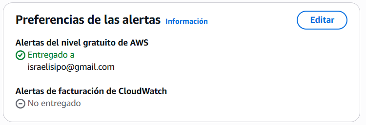

 

#### Microsoft Azure

**1. Lista de presupuestos con costo actual en $0.00 USD:**

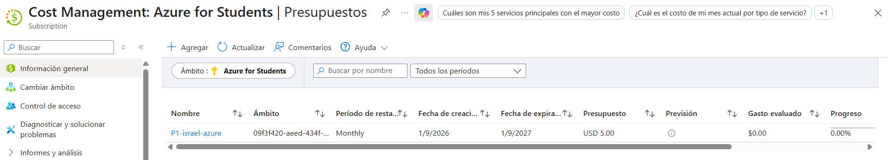

 

**2. Detalle del presupuesto con los 4 umbrales:**

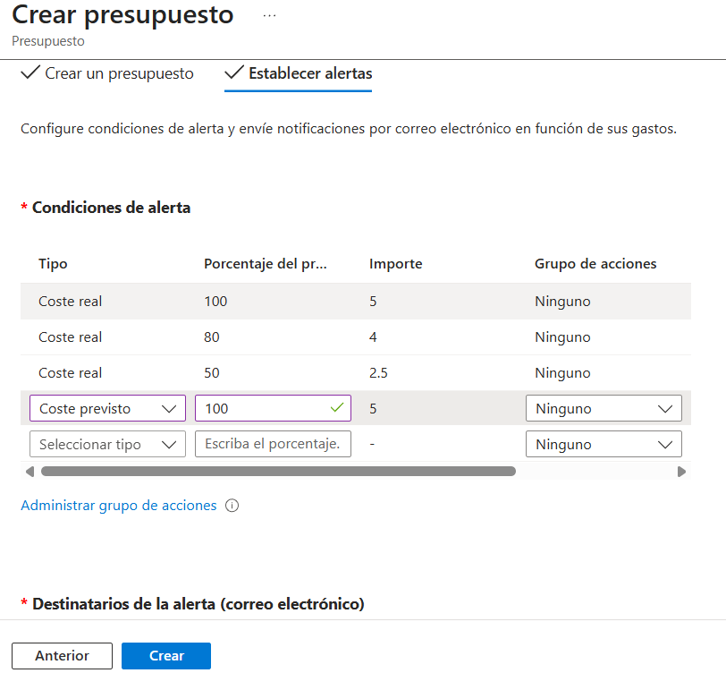

 

**3. Evidencia viva de monitoreo continuo en Cost Management:**

---

## 3. Estimaciones de costos (Arquitectura de Referencia - Actividad A3)

Se estimó la arquitectura de referencia compuesta por:
* 1 VM Linux (2 vCPU, 4 GB RAM, encendida 730 h al mes, 30 GB SSD).
* 1 Base de datos relacional gestionada (1-2 vCPU, 2-4 GB RAM, 20 GB almacenamiento).
* 50 GB de almacenamiento de objetos con 100,000 solicitudes mensuales.
* 1 Balanceador de carga de aplicaciones.
* 100 GB de tráfico de salida (*egress*) a internet al mes.

### Tabla 2.1 Estimación en Amazon Web Services (AWS)
*Archivos exportados disponibles en `evidencias/P01/costos/AWS_Mexico_Estimate.pdf` y `AWS_USEast_Estimate.pdf`.*

| Recurso | Unidad de cobro | Cantidad | Subtotal México (`mx-central-1`) | Subtotal EE. UU. (`us-east-1`) | ¿Capa gratuita? |
| :--- | :--- | :--- | :--- | :--- | :--- |
| VM (EC2 `t4g.small` + 30 GB EBS gp2) | Instancia-hora + GB-mes | 730 h / 30 GB | $16.00 USD | $15.26 USD | Sí (primeros meses/créditos) |
| BD gestionada (RDS PostgreSQL `db.t4g.micro`) | Instancia-hora + GB-mes | 730 h / 20 GB | $14.83 USD | $13.98 USD | Sí (750h `db.t4g.micro`) |
| Almacenamiento de objetos (Amazon S3 Standard) | GB-mes + Peticiones | 50 GB / 100k req | $1.73 USD | $1.73 USD | Parcial (primeros 5 GB) |
| Balanceador de aplicación (ALB) | Horas de balanceador + LCU | 730 h / 1 LCU | $17.50 USD | $16.66 USD | No |
| Salida a internet (*Data Egress*) | GB transferido | 100 GB | $9.00 USD | $9.00 USD | Parcial (primeros 100 GB) |
| **Total mensual** | | | **$59.06 USD** | **$56.63 USD** | |
| **Total anual** | | | **$708.72 USD** | **$679.56 USD** | |
| **Diferencia porcentual** | | | **+4.29% en México** | Base comparativa | |

### Tabla 2.2 Estimación en Microsoft Azure
*Archivos exportados disponibles en `evidencias/P01/costos/Azure_Mexico_Estimate.pdf` y `Azure_USEast_Estimate.pdf`.*

| Recurso | Unidad de cobro | Cantidad | Subtotal México (`Mexico Central`) | Subtotal EE. UU. (`East US`) | ¿Capa gratuita? |
| :--- | :--- | :--- | :--- | :--- | :--- |
| VM (B2s: 2 vCPU, 4 GB + 32 GB SSD) | Instancia-hora + GB-mes | 730 h / 32 GB | $38.20 USD | $33.58 USD | No |
| BD gestionada (Azure Database for PostgreSQL) | Instancia-hora + GB-mes | 730 h / 20 GB | $22.10 USD | $19.50 USD | No |
| Almacenamiento de objetos (Azure Blob Storage Hot) | GB-mes + Operaciones | 50 GB / 100k ops | $1.25 USD | $1.05 USD | Parcial (primeros 5 GB) |
| Application Gateway (v2) | Horas de gateway + Unidades | 730 h | $26.40 USD | $23.20 USD | No |
| Salida de datos (*Egress*) | GB transferido | 100 GB | $11.00 USD | $8.70 USD | Parcial (primeros 100 GB) |
| **Total mensual** | | | **$98.95 USD** | **$86.03 USD** | |
| **Total anual** | | | **$1,187.40 USD** | **$1,032.36 USD** | |
| **Diferencia porcentual** | | | **+15.02% en México** | Base comparativa | |

---

## 4. Características esenciales del NIST comprobadas en la consola (Actividad B2)

A continuación se evidencian las 5 características esenciales definidas por NIST SP 800-145:

### 1. Autoservicio bajo demanda (*On-demand self-service*)
El aprovisionamiento de capacidad de cómputo y almacenamiento se realiza de forma totalmente autónoma mediante la consola web sin interacción humana con personal del proveedor de nube. El cliente configura y lanza los recursos de manera inmediata y automatizada.

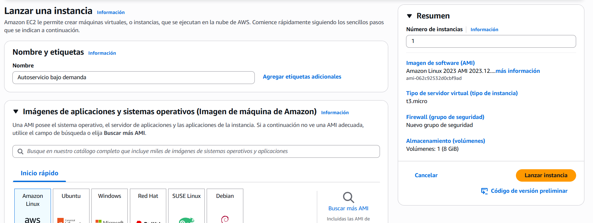

 

### 2. Amplio acceso a la red (*Broad network access*)
Las capacidades y servicios del proveedor están disponibles a través de la red y pueden operarse mediante mecanismos e interfaces estándar independientemente de la plataforma o dispositivo del cliente. Se comprobó accediendo a través de AWS CloudShell mediante el comando `aws sts get-caller-identity`.

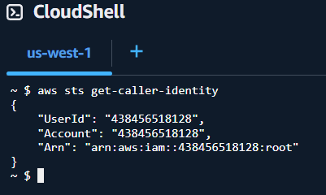

 

### 3. Agrupación de recursos (*Resource pooling*)
Los recursos físicos de hardware están agrupados para atender de manera multi-inquilino a múltiples clientes, asignándose dinámicamente según la demanda. El usuario desconoce la ubicación exacta del silicio o bastidor físico, visualizando abstracciones lógicas como zonas de disponibilidad en Querétaro (`mx-central-1a` y `mx-central-1b`).

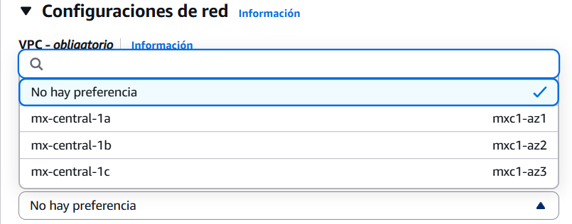

 

### 4. Elasticidad rápida (*Rapid elasticity*)
Las capacidades de cómputo pueden aprovisionarse y liberarse de manera elástica y automática para escalar hacia afuera o hacia arriba según la demanda operativa. En la consola se evidencia mediante la parametrización de capacidades mínimas, deseadas y máximas en un grupo de autoescalado (*Auto Scaling Group*).

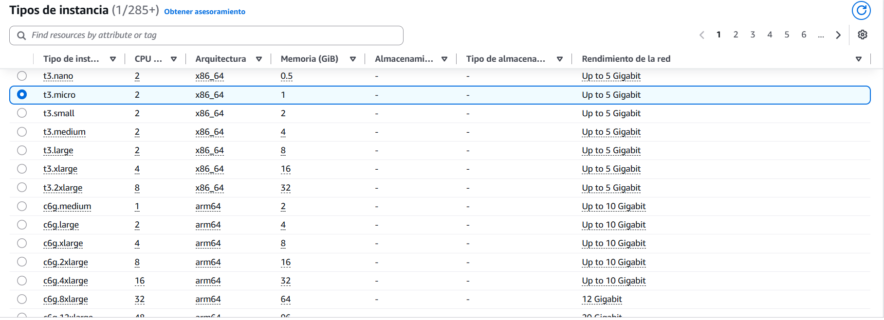

 

### 5. Servicio medido (*Measured service*)
El consumo de recursos se monitorea, controla y mide de forma cuantitativa y transparente mediante métricas específicas (horas de ejecución, GB almacenados por mes y volumen de peticiones API). Esto sustenta el modelo de pago por uso (*pay-per-use*) y permite el control de costos mediante paneles de facturación y presupuestos.

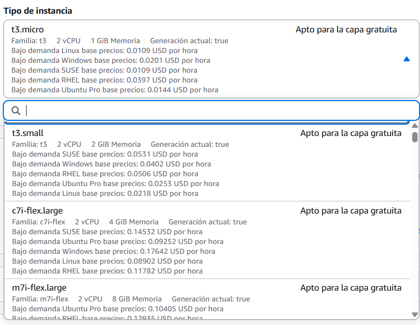

---

## 5. Auditoría de inventario en cero y facturación (Actividad B3)

Se auditó la infraestructura en todas las regiones para garantizar que no existan recursos cobrables encendidos:

* **Inventario en AWS (Resource Explorer):** Reporta únicamente 22 recursos de red por defecto (VPC, subredes, tablas de ruteo, grupo de seguridad default y el grupo primario de Athena). Ninguno corresponde a cómputo (EC2), discos asociados (EBS) o balanceadores (ELB), manteniendo el consumo en 0.00 USD.
* **Inventario en Azure (Todos los recursos):** Reporta 0 recursos desplegados en la suscripción de estudiantes.

### Evidencias de Inventario y Saldo en Cero

#### Amazon Web Services (AWS)

**1. Inventario de recursos en AWS:**

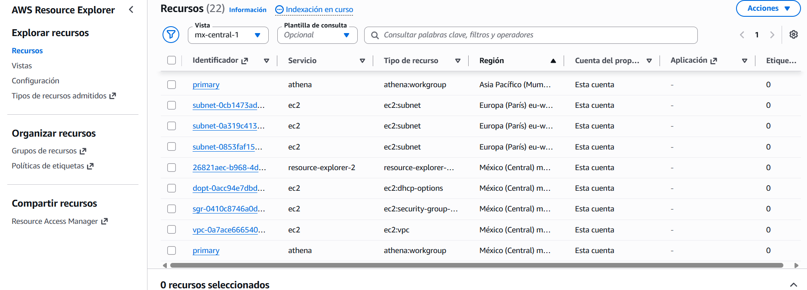

 

**2. Gasto facturado en AWS ($0.00 USD):**

 

#### Microsoft Azure

**1. Inventario de recursos en Azure:**

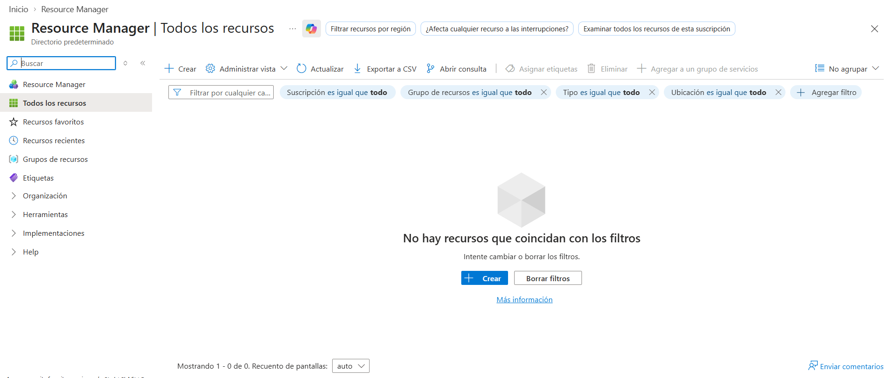

 

**2. Gasto facturado en Azure ($0.00 USD):**

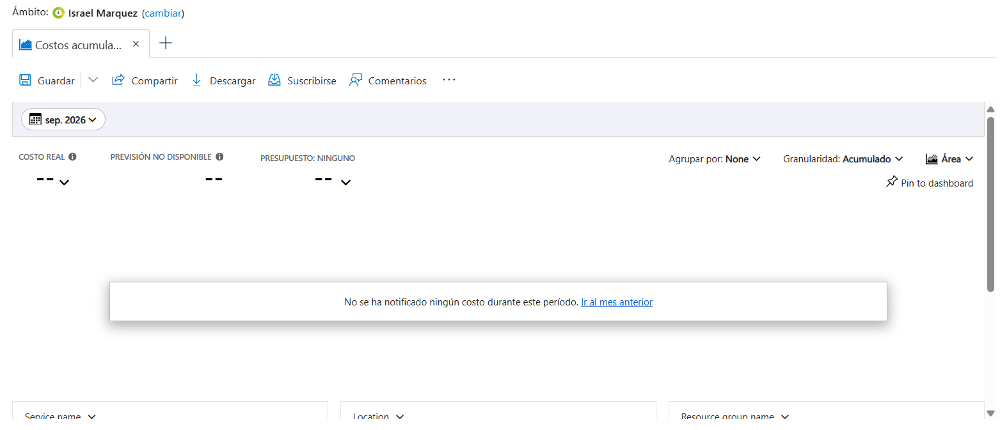

---

## 6. Preguntas de análisis

### 1. ¿Conviene una cuenta compartida del equipo o una por integrante? Comparar riesgos y ventajas en costos y en seguridad.
Conviene utilizar una cuenta central compartida administrada bajo un esquema de organización (como AWS Organizations o grupos de recursos en Azure con control de acceso RBAC), o bien mantener cuentas individuales para experimentación aislada y una sola cuenta oficial para el proyecto. Tener una sola cuenta compartida con una única credencial raíz expone al equipo a un riesgo crítico de seguridad: si un integrante filtra la clave o sube accidentalmente las credenciales a GitHub, todo el entorno y la tarjeta asociada quedan comprometidos. Por otro lado, tener cuentas totalmente separadas sin supervisión fragmenta los presupuestos y complica el monitoreo del gasto acumulado. La mejor práctica observada consiste en delegar privilegios mínimos a cada integrante mediante identidades federadas (IAM/Entra ID) manteniendo un presupuesto consolidado y centralizado con alertas activas.

### 2. ¿Cuánto más cara resultó la región de México respecto a la de Estados Unidos y en qué recurso está la mayor diferencia? ¿Cuándo elegirías México de todos modos?
La región de México (`mx-central-1`) resultó ser un **4.29% más cara** que la región de EE. UU. Este (`us-east-1`), representando una diferencia anual de $29.16 USD ($708.72 USD en MX vs $679.56 USD en EE. UU.). La mayor diferencia de costo se encuentra en los servicios de cómputo y balanceo de carga (EC2 resulta $0.59 USD más caro y el Balanceador de Carga ALB resulta $0.84 USD más caro en México debido a los costos operativos locales de infraestructura). Elegiría la región de México a pesar del costo superior cuando los requisitos del sistema exigan una **latencia mínima (menor a 15-20 ms)** para usuarios locales finales o por cumplimiento regulatorio estricto de la **LFPDPPP (Ley Federal de Protección de Datos Personales en Posesión de los Particulares)**, donde la soberanía y residencia física de los datos dentro del territorio nacional sea un requisito legal o bancario ineludible.

### 3. ¿Qué recursos de la arquitectura de referencia seguirían cobrando aunque apagaras la máquina virtual?
Apagar la máquina virtual (*stopped*) únicamente detiene el cobro por hora de los vCPU y la memoria RAM, pero los siguientes recursos continúan facturándose de manera ininterrumpida:
* **Almacenamiento en bloque (discos SSD/EBS gp3):** Se cobra por capacidad aprovisionada en GB-mes ($0.08 a $0.10 USD por GB-mes) porque el bloque sigue reservado físicamente en el centro de datos.
* **Direcciones IPv4 públicas asociadas:** AWS cobra $0.005 USD por hora por cada dirección IPv4 pública asignada a instancias inactivas o sin usar (~$3.60 USD mensuales).
* **Base de datos relacional gestionada:** Continúa cobrando el 100% de su tarifa por hora de instancia y el almacenamiento en disco asignado, independientemente de si recibe consultas.
* **Balanceador de carga de aplicación:** Mantiene su cargo base por hora de aprovisionamiento (~$0.025 USD/hora) aunque no procese tráfico.
* **Almacenamiento de objetos (S3 / Blob Storage):** Cobra la cuota por GB-mes de los datos en reposo existentes.

### 4. Para el proyecto de tu equipo, ¿qué modelo de servicio conviene para el cómputo y qué unidad de cobro implica? Justificar con lo visto en la consola.
Para el proyecto de este semestre conviene adoptar un modelo de **PaaS o Serverless (FaaS / Contenedores gestionados como Cloud Run o Azure Container Apps)**. Al explorar la consola se constató que la infraestructura como servicio (IaaS mediante VMs tradicionales) cobra de forma continua por hora o segundo mientras la instancia permanezca encendida, requiriendo además configuración manual de parches del sistema operativo y redes. En contraste, las soluciones basadas en funciones o contenedores gestionados operan bajo un modelo de cobro por consumo real medido en **invocaciones y vCPU-segundo / GB-segundo**, contando con la capacidad de escalar a cero (*scale-to-zero*) cuando no existan peticiones activas. Esto optimiza drásticamente los créditos educativos disponibles al no acumular costos durante los periodos en que el equipo no esté realizando pruebas.

### 5. ¿Qué mecanismo ofrece uno de tus proveedores para detener o limitar el gasto automáticamente?
En **AWS**, las alertas estándar de AWS Budgets avisan por correo electrónico pero no cortan el servicio por defecto. Para forzar la detención del gasto, AWS Budgets permite configurar **Budget Actions** (Acciones de presupuesto). Al definir el presupuesto, en la pestaña de acciones se vincula un rol de IAM y se define una regla automatizada: cuando el gasto real alcance el 100% del umbral (5 USD), AWS ejecuta de forma autónoma una de tres acciones: (1) aplicar una política SCP/IAM restrictiva que revoque los permisos de creación de nuevos recursos a los usuarios, (2) apagar automáticamente instancias EC2 o bases de datos RDS mediante la ejecución de una función AWS Lambda integrada con Systems Manager, o (3) suspender el balanceador de carga. Esto previene eficazmente el *bill shock* ante cualquier ataque o descuido.

### 6. Oracle recortó a la mitad su capa Always Free (junio de 2026) y AWS pasó a un plan gratuito que se cierra solo a los seis meses (julio de 2025). ¿Qué te dice esto sobre depender de capas gratuitas y qué haría tu equipo para no quedarse sin nube a mitad del semestre?
Estos cambios de políticas demuestran que las capas gratuitas son incentivos comerciales que los proveedores pueden modificar o revocar sin previo aviso, lo que genera un riesgo de continuidad operativa. Para mitigar este riesgo y garantizar la continuidad del proyecto nuestro equipo puede hacer lo siguiente:
1. **Desacoplamiento arquitectónico:** Diseñar componentes en contenedores portables (Docker) que puedan migrarse.
2. **Estrategia multicuenta escalonada:** Alternar el despliegue entre los créditos educativos de Azure for Students y las cuentas de AWS, utilizando una cuenta secundaria de respaldo en caso de que la principal alcance el límite de tiempo.
3. **Mantener todo apagado:** Implementar buenas prácticas para mantener los recursos encendidos únicamente durante los ensayos y pruebas de laboratorio y apagar todo cuando no se necesite.

---

## 7. Lista de verificación de seguridad y costos

- [x] Las alertas de presupuesto de 5 USD están configuradas y activas en todas las cuentas del equipo.
- [x] En AWS se configuró y verificó adicionalmente el presupuesto de gasto cero (*Zero spend budget*).
- [x] Se confirmó que el inventario global de recursos activos se encuentra en cero o debidamente justificado.
- [x] El saldo actual facturado del mes en todas las consolas marca estrictamente **0.00 USD**.
- [x] Se inspeccionaron todas las capturas y archivos de evidencia; ninguna muestra números de tarjeta, tokens, claves privadas ni credenciales de API.
- [x] El repositorio no contiene archivos sensibles como `.env`, `.pem` o llaves JSON de cuentas de servicio.

---

## 8. Conclusiones y Referencias

### Conclusiones
La realización de esta práctica permitió comprender que la administración de sistemas distribuidos y cómputo en la nube exige una responsabilidad técnica y financiera estricta desde el primer momento. La característica de *servicio medido* del cómputo en la nube representa una gran ventaja para la elasticidad de costos, pero demanda la adopción inmediata de prácticas FinOps como la parametrización de presupuestos y umbrales preventivos para evitar cobros inesperados (*bill shock*).

### Referencias
* AWS. (2024). *New - AWS Public IPv4 Address Charge*. AWS News Blog. https://aws.amazon.com/blogs/aws/new-aws-public-ipv4-address-charge-public-ip-insights/
* AWS. (2026). *AWS Pricing Calculator*. https://calculator.aws/
* Mell, P., & Grance, T. (2011). *The NIST Definition of Cloud Computing* (Special Publication 800-145). National Institute of Standards and Technology. https://doi.org/10.6028/NIST.SP.800-145
* Microsoft Learn. (2026). *Tutorial: Create and manage budgets in Cost Management*. https://learn.microsoft.com/azure/cost-management-billing/costs/tutorial-acm-create-budgets
* Microsoft. (2026). *Azure Pricing Calculator*. https://azure.microsoft.com/pricing/calculator/
* van Steen, M., & Tanenbaum, A. S. (2024). *Distributed Systems* (4.ª ed., versión 4.03). Maarten van Steen. https://www.distributed-systems.net/

---

## 9. Sección obligatoria: «Uso de IA»
* **Herramienta utilizada:** Gemini (Google)
* **Finalidad y alcance del apoyo:** Se utilizó como asistente para estructurar la plantilla del reporte en formato Markdown, guía para la configuración de alertas/presupuestos y resolver dudas de autenticación en las consolas de AWS y Azure. Capturas y cifras fueron verificados y validados manualmente por nosotros.

---

## 10. Tabla de contribución del equipo

| Sección | Responsable | Entregables Principales | Aportación |
| :--- | :--- | :--- | :--- |
| *(Costos y Calculadoras)* | Esaul Tellez de la Cruz | • Estimar la arquitectura de referencia en la calculadora del Proveedor A (AWS) y Proveedor B (Azure) (México vs. EE. UU. = 4 estimaciones). • Realizar la estimación preliminar del proyecto del equipo. • Llenar la Tabla 2 del reporte y exportar los archivos a `evidencias/P01/costos/`. • Redactar respuestas a las Preguntas 2 y 3 (comparativa México vs. EE. UU. y costos ocultos si se apaga la VM). | 33.3% |
| *(Modelos de Servicio e IA)* | [Nombre de Persona B] | • Realizar la exploración de B1 en el Proveedor A (AWS) y Proveedor B (Azure) (los 14 servicios: IaaS, PaaS, FaaS, contenedores, BD, objetos, IA) sin crear recursos. • Investigar el ejemplo de SaaS (precios y justificación). • Llenar la Tabla 3 del reporte con unidades de cobro y disponibilidad en Querétaro/México. • Redactar respuesta a la Pregunta 4 (modelo ideal para el proyecto). | 33.3% |
| *(NIST, Seguridad y Repositorio)* | Israel Márquez Cárdenas | • Obtener las capturas y redacción de B2: las 5 características del NIST en consola/CLI. • Coordinar B3: revisión de inventario en cero, saldo de créditos y auditoría de seguridad (verificar que ninguna captura muestre llaves o credenciales). • Estructurar el archivo `practicas/P01/README.md`, consolidar la Tabla 1 y redactar las bitácoras (`2026-09-01.md` y `2026-09-08.md`). | 33.4% |